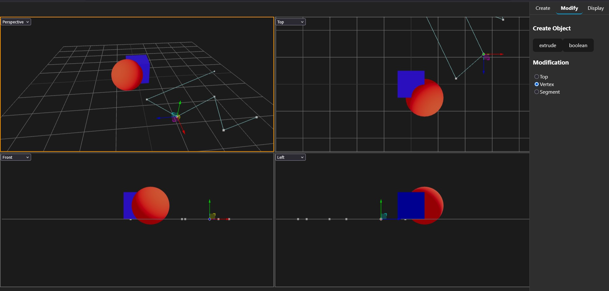

# CADLab (Work in Progress)

> 🚧 Currently building a **CAD-like editor** inspired by the **Atodesk 3ds Max multi-viewport system**, to learn **Three.js**, **React Three Fiber (R3F)**, and modern frontend architecture.

---

## ✨ Project Goals

- Learn and practice **Three.js** & **R3F** through a non-trivial project.
- Recreate familiar CAD workflows (creation tools, modify panel, vertex/segment editing).
- Experiment with a **multi-viewport system** (top, front, side, perspective) like 3ds Max.
- Design a clean **reactive architecture** with Zustand as the single source of truth.

---

## 🧱 Current Features

- Multi-viewport layout (top, front, side, perspective).
- Shape/Object creation tools (Polyline, Arc, Box …).
- Extrude and Boolean modification tools
- **Reactive editing**:
  - Shapes subscribe to their own data in a global `featureStore` (Zustand).
  - Moving control points with TransformControls updates geometry live.

---

## 🚀 Tech Stack

- [Three.js](https://threejs.org/) – core 3D engine
- [React Three Fiber](https://docs.pmnd.rs/react-three-fiber/getting-started/introduction) – React bindings for Three.js
- [Zustand](https://github.com/pmndrs/zustand) – global state management
- [React](https://reactjs.org/) – UI + tool panels

---
